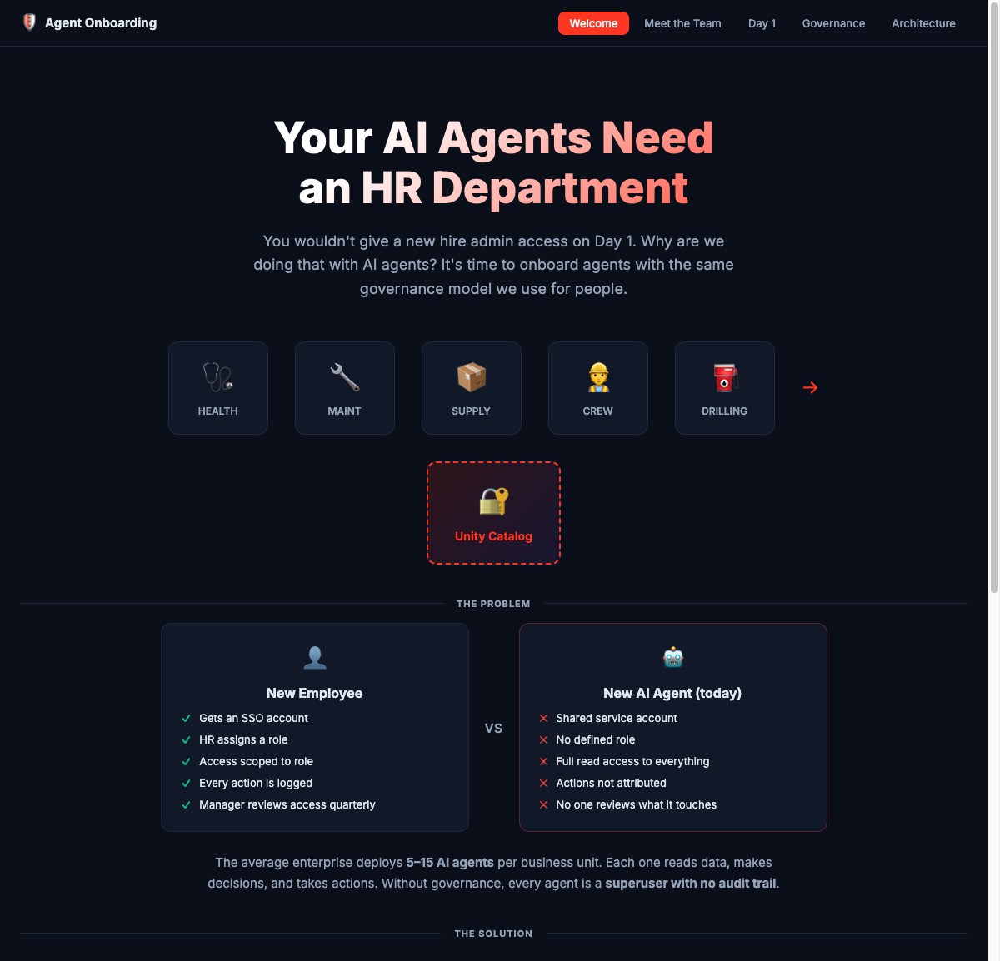
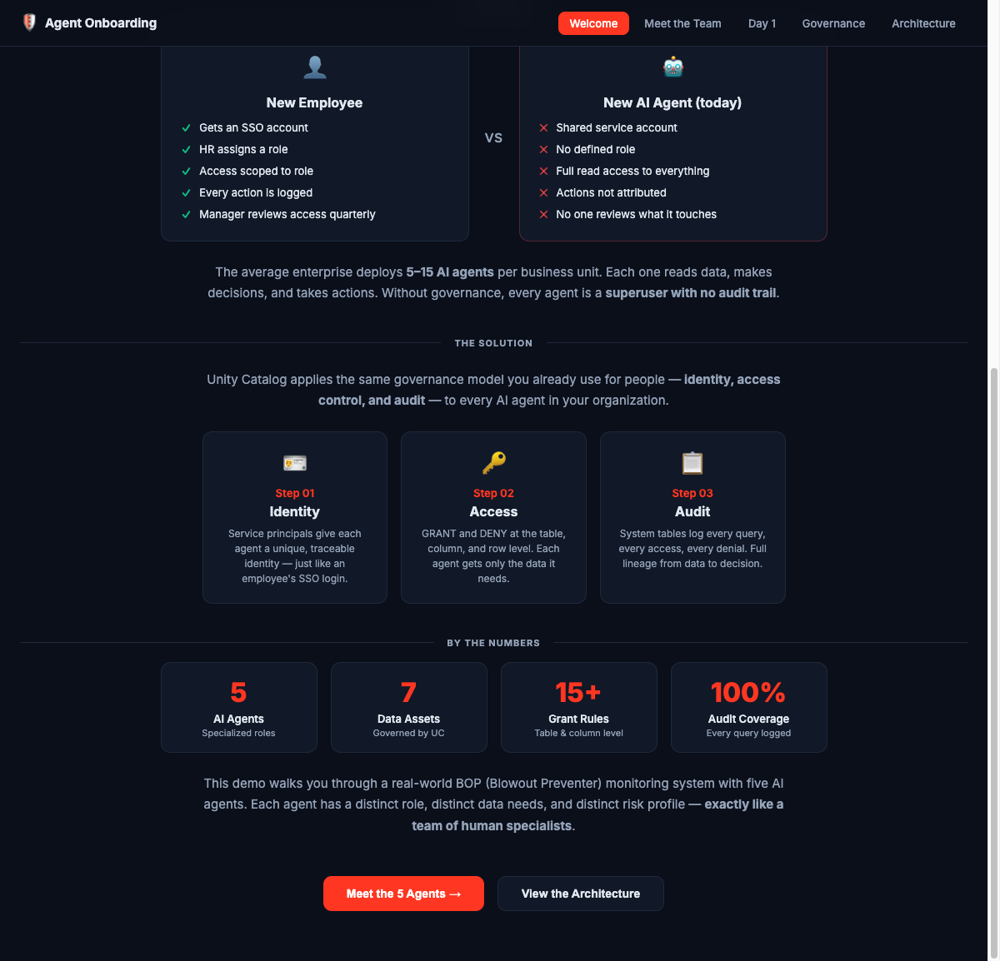
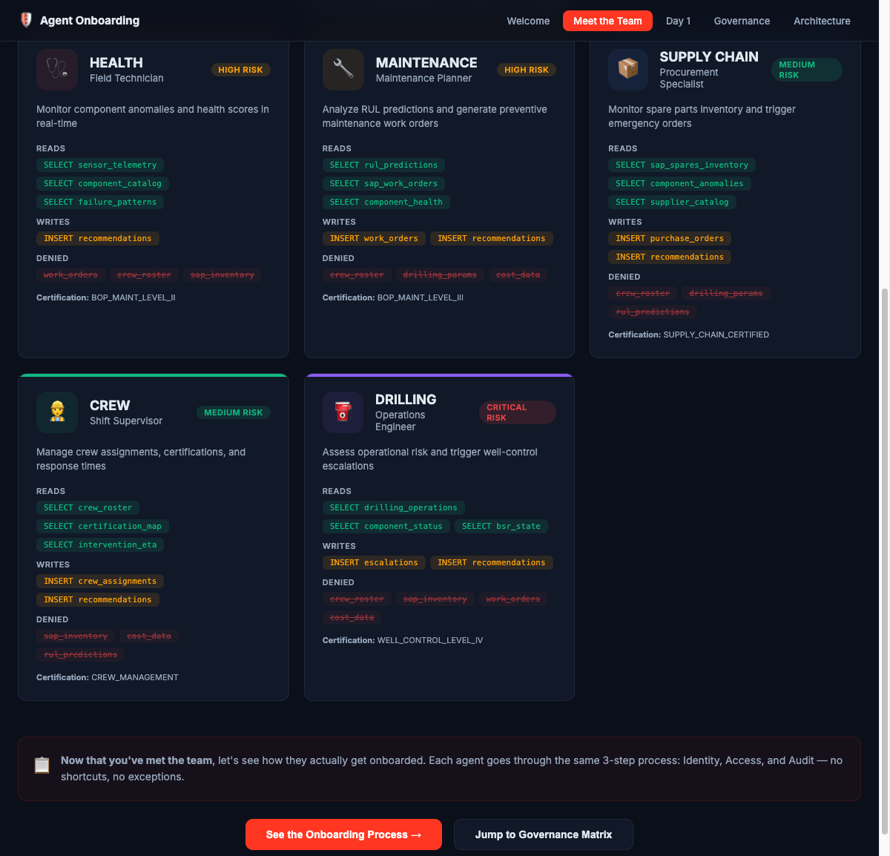
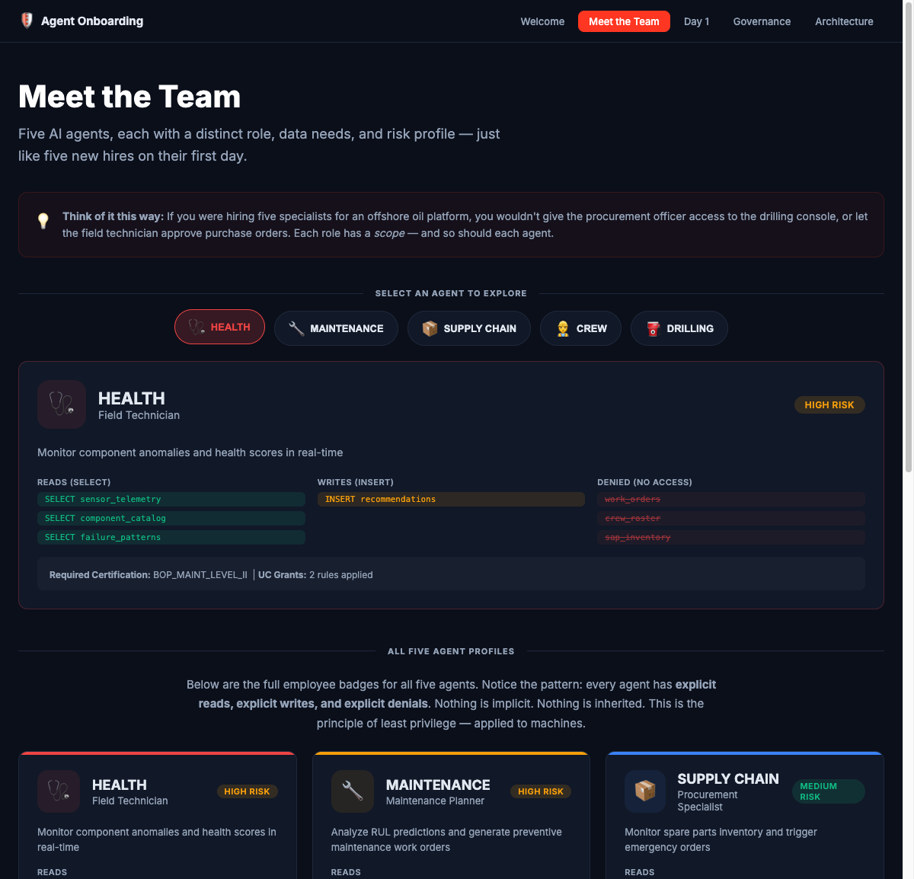
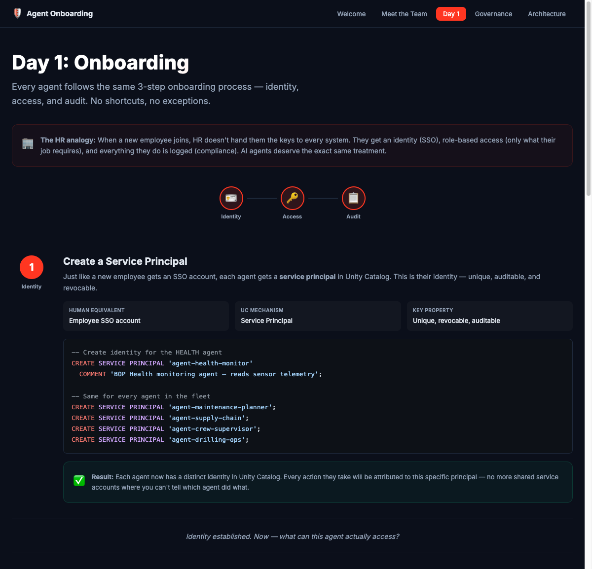
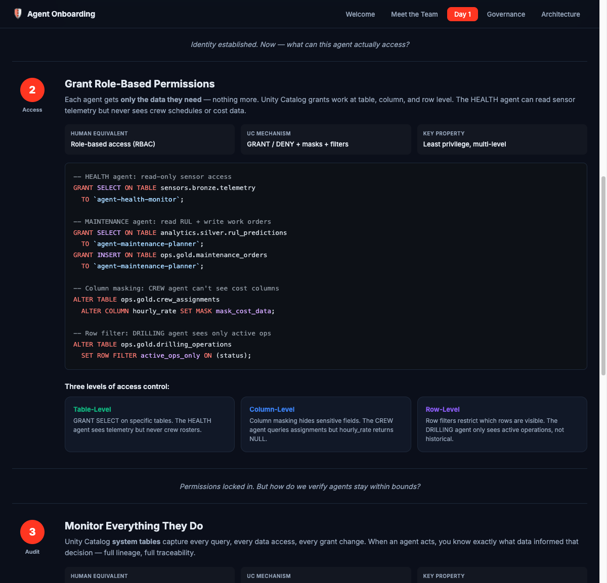
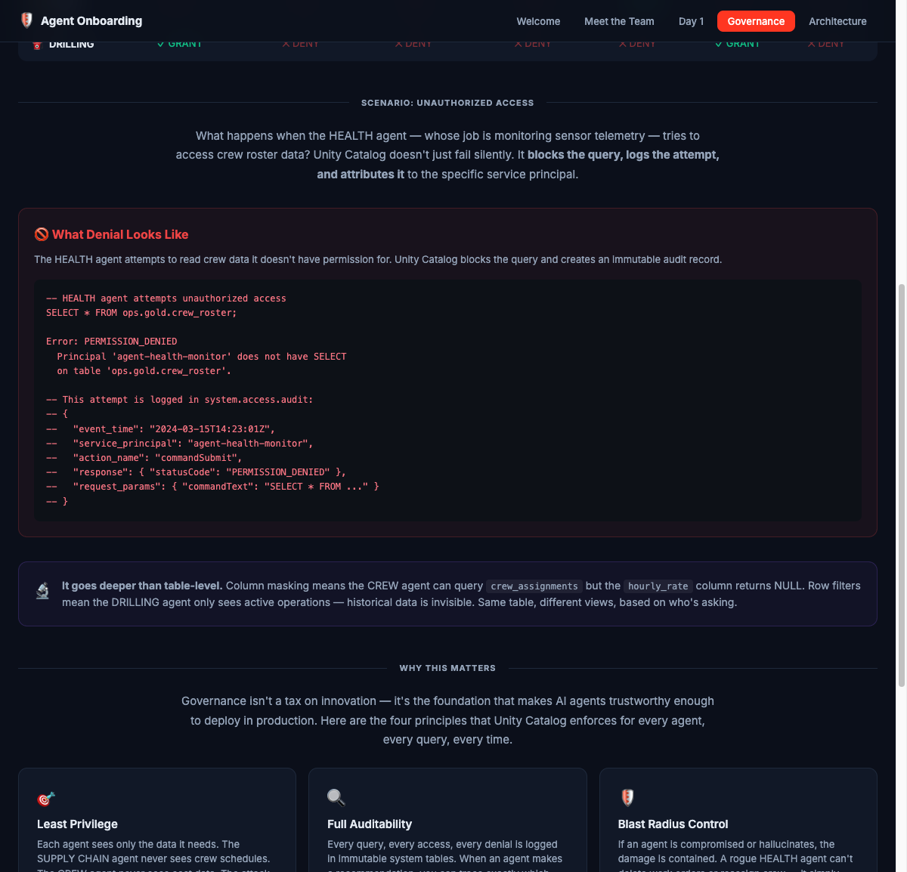
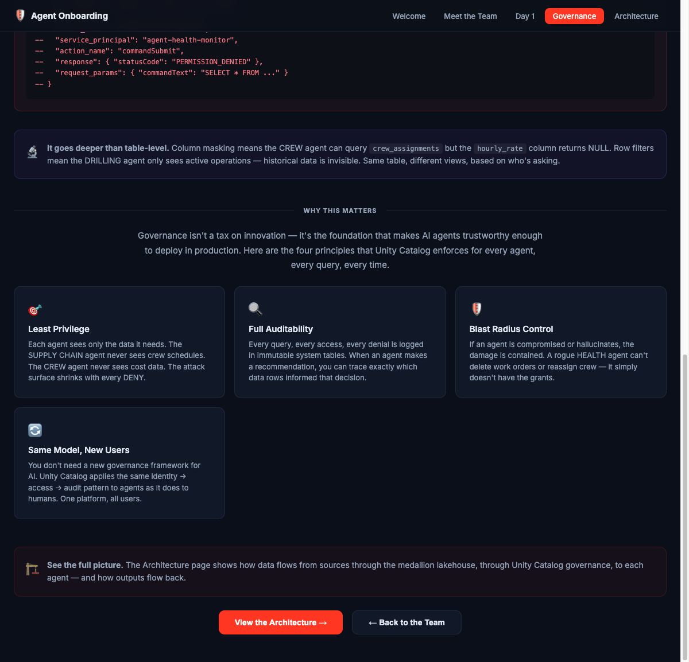
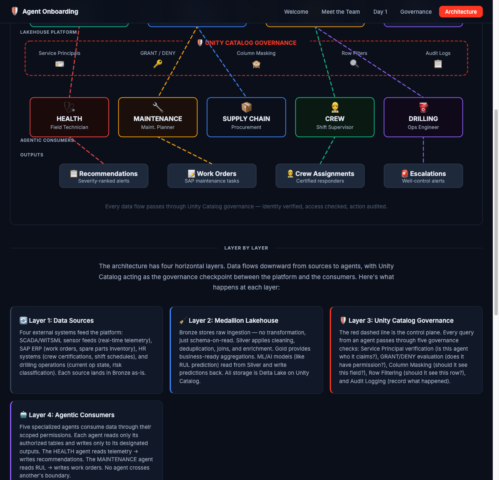
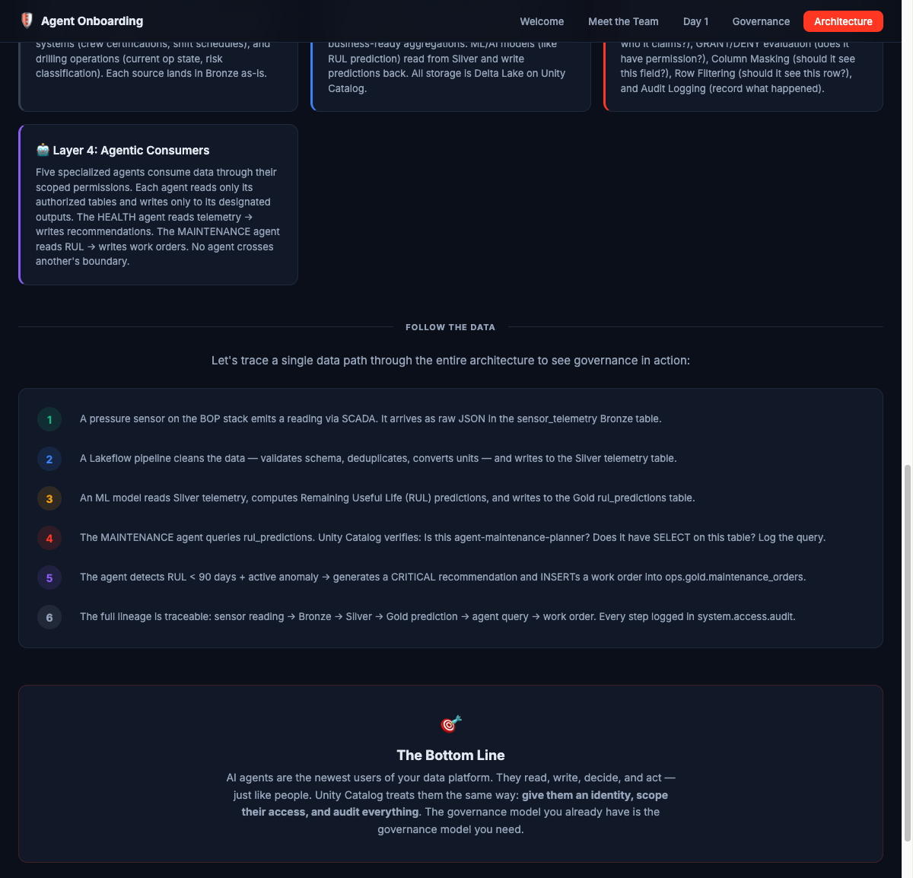

# Your AI Agents Need an HR Department

## Onboarding agentic users with the same governance model you already use for people



---

Every enterprise I work with is deploying AI agents. Not one or two — fleets of them. Agents that read sensor telemetry, generate maintenance work orders, trigger procurement, assign crew, and escalate well-control events. These agents are making decisions that used to require a human in the loop.

Here's the problem: most organizations treat these agents like they're invisible.

No identity. No scoped access. No audit trail. A shared service account with read access to everything, writing to whatever table it wants, with no way to trace which agent did what.

You wouldn't do that with a new hire. Why are you doing it with AI?

---

## The Gap Between Human Governance and Agent Governance

When a new employee joins your organization, HR follows a playbook. They get an SSO account — a unique, traceable identity. They get role-based access — only the systems their job requires. And everything they do is logged for compliance.

Now look at how most teams deploy AI agents today.



Shared service accounts. No defined role. Full read access to everything. Actions that can't be attributed to a specific agent. No one reviewing what they touch.

The average enterprise deploys 5–15 AI agents per business unit. Each one reads data, makes decisions, and takes actions. Without governance, every agent is a superuser with no audit trail.

That gap is not a technical limitation. The governance model already exists. It just hasn't been applied to machines yet.

---

## Five Agents, Five Roles — Same as Five New Hires

To make this concrete, I built an interactive app around a real-world scenario: BOP (Blowout Preventer) monitoring on an offshore drilling platform. Five AI agents, each with a distinct operational role — exactly like five human specialists.



Each agent has a specific mission, specific data it needs to read, specific outputs it writes, and — critically — specific data it should **never** touch.

- **HEALTH** — Field Technician. Reads sensor telemetry and failure patterns. Writes recommendations. Never sees crew rosters, cost data, or SAP inventory.
- **MAINTENANCE** — Maintenance Planner. Reads RUL predictions and SAP work orders. Writes maintenance orders. Never sees drilling params or crew schedules.
- **SUPPLY CHAIN** — Procurement Specialist. Reads spare parts inventory. Writes purchase orders. Never sees crew data or RUL models.
- **CREW** — Shift Supervisor. Reads crew rosters and certification maps. Writes crew assignments. Never sees cost columns or SAP inventory.
- **DRILLING** — Operations Engineer. Reads drilling operation state and component status. Writes escalations. Never sees crew rosters, work orders, or cost data.

Click into any agent and the access pattern is explicit — reads, writes, and denials.



Notice the pattern: every agent has **explicit reads, explicit writes, and explicit denials**. Nothing is implicit. Nothing is inherited. This is the principle of least privilege — applied to machines.

---

## Day 1: Onboarding an Agent

Every agent follows the same three-step onboarding process. Identity, Access, Audit. No shortcuts.

### Step 1 — Identity

Just like a new employee gets an SSO account, each agent gets a **service principal** in Unity Catalog. This is their identity — unique, auditable, and revocable.



```sql
CREATE SERVICE PRINCIPAL 'agent-health-monitor'
  COMMENT 'BOP Health monitoring agent — reads sensor telemetry';
```

Five agents, five service principals. Every action they take from this point forward is attributed to their specific identity. No more shared accounts where you can't tell which agent did what.

### Step 2 — Access

Each agent gets only the data it needs. Unity Catalog grants work at three levels:



**Table-level** — the HEALTH agent gets `SELECT` on `sensors.bronze.telemetry` but never sees `ops.gold.crew_roster`.

**Column-level** — the CREW agent queries `crew_assignments` but the `hourly_rate` column returns NULL. Column masking hides what the role doesn't need.

**Row-level** — the DRILLING agent only sees active operations. Historical data is invisible. Same table, different view, based on who's asking.

```sql
-- HEALTH agent: read-only sensor access
GRANT SELECT ON TABLE sensors.bronze.telemetry
  TO `agent-health-monitor`;

-- Column masking: CREW agent can't see cost columns
ALTER TABLE ops.gold.crew_assignments
  ALTER COLUMN hourly_rate SET MASK mask_cost_data;

-- Row filter: DRILLING agent sees only active ops
ALTER TABLE ops.gold.drilling_operations
  SET ROW FILTER active_ops_only ON (status);
```

### Step 3 — Audit

Unity Catalog system tables capture every query, every data access, every denial. When an agent makes a recommendation, you can trace exactly which data informed that decision.

```sql
-- What did the HEALTH agent access today?
SELECT event_time, action_name, request_params.table_name
FROM system.access.audit
WHERE user_identity.service_principal = 'agent-health-monitor'
  AND event_date = current_date()
ORDER BY event_time DESC;
```

Full lineage. Full traceability. From sensor reading to agent recommendation to audit log.

---

## The Governance Matrix

Put it all together and you get a single view of every agent's access across every data asset.



More red than green. That's by design. In a well-governed system, agents should be denied more than they're granted. Each agent touches only what it absolutely needs.

And when an agent tries to access something outside its scope? Unity Catalog blocks the query, logs the attempt, and attributes it to the specific service principal.



```
Error: PERMISSION_DENIED
  Principal 'agent-health-monitor' does not have SELECT
  on table 'ops.gold.crew_roster'.
```

That attempt is now an immutable record in `system.access.audit`. Queryable. Alertable. Traceable.

---

## The Architecture

Data flows from four external sources through the medallion lakehouse, through Unity Catalog governance, to five specialized agents — each with scoped access.



The dashed red line is the control plane. Every query from an agent passes through five governance checks: service principal verification, GRANT/DENY evaluation, column masking, row filtering, and audit logging.

Follow a single data path through the entire stack:



1. A pressure sensor emits a reading via SCADA → lands in Bronze
2. Lakeflow pipeline cleans and enriches → Silver
3. ML model computes RUL predictions → Gold
4. MAINTENANCE agent queries `rul_predictions` → Unity Catalog verifies identity, checks grants, logs the query
5. Agent detects RUL < 90 days + active anomaly → generates a CRITICAL work order
6. Full lineage traceable: sensor → Bronze → Silver → Gold → agent query → work order → audit log

Every step governed. Every step logged.

---

## The Bottom Line

AI agents are the newest users of your data platform. They read, write, decide, and act — just like people. The governance model you need for them is the governance model you already have.

**Identity** — service principals give each agent a unique, traceable identity.

**Access** — GRANT and DENY at table, column, and row level. Least privilege, enforced.

**Audit** — system tables log every query, every access, every denial. Full lineage from data to decision.

Unity Catalog doesn't require a new framework. It applies the same controls to agents that it applies to humans. One platform, all users.

The interactive app is open source: [github.com/Reishin-DB/agent-onboarding](https://github.com/Reishin-DB/agent-onboarding)

---

*Reishin Toolsi is a Solutions Architect at Databricks focused on upstream oil & gas. The BOP Guardian agents referenced in this post are from a real-time blowout preventer monitoring solution built on the Databricks Lakehouse Platform.*

*Disclaimer: This application is a demonstration and should not be used for production safety-critical decisions without proper validation and certification.*
